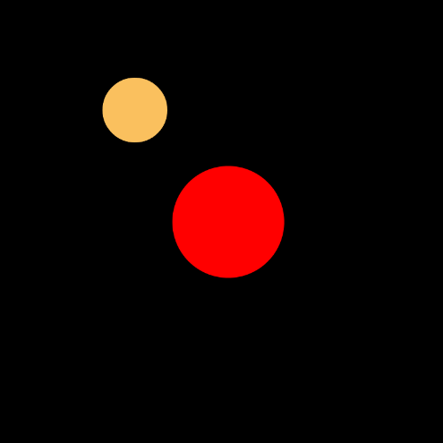

[Home 🏠](README.md) / [Portfolio 💼](https://sabrinarath263.wixsite.com/srathdesigns) / [Reflective Journal 📓](Journal.md) / [Assignments&Challenges](Assignments.md) / [Prototypes 💻](Prototypes.md)

# **Assignments/Challenges** 👩‍🏫

>Here is where you can acces all the assignments and challenges we've done for the whole term.

## 1. [Hello, World challenge](https://github.com/Sabiewasabi/CART253)

## 2. Landscape challenge

## **Overlook**

SABRINA RATH AND ERICA GAVEZ

[View this project online](https://sabiewasabi.github.io/CART253/topics/landscape-challenge/)

[View the code of this project](https://github.com/Sabiewasabi/CART253/blob/main/topics/landscape-challenge/js/landscape.js)

## Description

> The aim for this project was to recreate some sort of scenery that can be viewed from anywhere outside in nature. When I suggested the idea, I had thought about road trips and looking outside of a car window to admire beautiful scenery (in this case, nature, mountains) as the car passes by unfamiliar places until you get to your selected destination.

## Screenshot(s)

## Attribution

> - This project uses [p5.js](https://p5js.org).
> - The image is a capture of *Overlook* live on p5.js

## License
> This project is licensed under a Creative Commons Attribution ([CC BY 4.0](https://creativecommons.org/licenses/by/4.0/deed.en)) license with the exception of libraries and other components with their own licenses.

## 3. Variable challenge

## **Mr. Furious gets FURIOUS!!!**

SABRINA RATH, KONSTANTINOS CHRISTODOULAKIS AND ERICA GAVEZ

[View this project online](https://sabiewasabi.github.io/CART253/topics/variable-challenge/)

[View the code of this project](https://github.com/Sabiewasabi/CART253/blob/main/topics/variable-challenge/js/mr-furious.js)

## Description

> A guy who becomes visibly furious becuase of a darn annoting bird! Mr.Furious becomes more red each second as a bird flies back and forth above his head.

## Screenshot(s)

## Attribution

> - This project uses [p5.js](https://p5js.org).
> - The image is a capture of *Mr.Fusion gets FURIOUS!!!* live on p5.js

## License

> This project is licensed under a Creative Commons Attribution ([CC BY 4.0](https://creativecommons.org/licenses/by/4.0/deed.en)) license with the exception of libraries and other components with their own licenses.