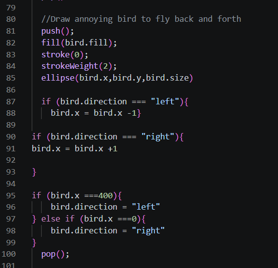

[Home 🏠](README.md) / [Portfolio 💼](https://sabrinarath263.wixsite.com/srathdesigns) / [Reflective Journal 📓](Journal.md) / [Assignments&Challenges](Assignments.md) / [Prototypes 💻](Prototypes.md)

# **Reflective journal** 📝

- ### My first impression of making a website and using Markdown - **09/11/2026**

> I would like to begin by saying that this whole experience turned out to be more chaotic than it should have been. 😅 The very first issue I ran into began with figuring out where exactly I had to begin coding the website and I did not expect it to be right within the READ.MD. After that, it was time to add in the image banner for our website. I follow the exact line of code to add an image to the website however it wasn't showing up after every pushed commit I made (that's why there so many commits counted on my GitHub). I fiddled around some more with the line of code and nothing was showing up on my page. LONG BEHOLD, it was because there was an extra space infront of my whole line of code. My computer science friends weren't jokiing when they said an additional space can break everything....Despite the chaos, I really enjoy how you can see every addition and changes you make through the Markdown Open Preview (that's how I learnt it the hard way that it was the additional typed space that prevented my banner from popping up - deleted it and POOF KIRBY WAS BORN!❤️). I've done some coding back in college, I wasn't all that terrible at it but I just need to jog my brain a bit to hit the ground running.

- ### Creating 3 prototypes - **09/14/2026**

> The process of brainstorming 3 ideas for 3 distinctevely different prototypes we're a bit challenging ony because the ideas I had we're so broad and I did'nt know where to start. A managed to come up with 3 decent prototypes. My ideas are decent but yet original in a way because they are idaeas stemmed from things I personnaly enjoy or would love to experience if someone else had made the project a reality. I would love to entertain my ideas for prototype 2 and 3 more since the are projects I believe are mor unique.To say the least, I am very satisfied with what I got so far. Now making these actually work is another challenge I will tackle for another day.

> <mark>**UPDATE - 09/22/2026**</mark> : I ended up working more on the *Click,clickmPoyo!* prototype, instead of it being a static image now it animates a different expression whenever you click on Kirby. I also reworked the second prototype for it to have a more weird aspect to the project in whole and so now it's called *Confusion Gamestation*. Instead of a text in the center of the gameboy screen, it now has a cute confused looking face.

- ### Instruction challenge - **09/15/2026**

> The challenge was a great way to get me to practice and work my muscle memories becuase I will admit I forgot a little bit of all the dfferent functions that existed in p5.js, just like the forloop();.I hope that we get to do more of these as we progress to regain my sense of confort with p5.js to feel on top of my game.HOwever, it goes without saying that I will practice at home too.

> I'd like to think of this class to serve as some sort of review class because I believe a few students are starting off as beginners anyways. 😅

- ### Variable challenge - **09/22/2026**

> This challenge was quite fun actually because I got to experience the mind boggling way to code the flying annoying bird to fly back and forth abov Mr.Furious. I had the logic down and ready to execute by using an "if" statement, however Micheal showed me quickly how it can get complicated. The main idea was to write if (bird.x ===0){bird.x +1} else if (bird.x === 400){bird.x -1}. In plain words, I wanted the bird to change directions once it has hit the end of the left side of the canvas and move on towards the right and vice-versa - that didn't work.Micheal then suggested that we give the bird another variable called "direction" and say "left" so the program knows exactly where it is going. I would explain further but I'm not sure how to myself, so here is an image instead:

> Not only am I bad at math but I am horrible with my directions...

- ## Creating 3 variable oriented prototypes - **09/25/2026**