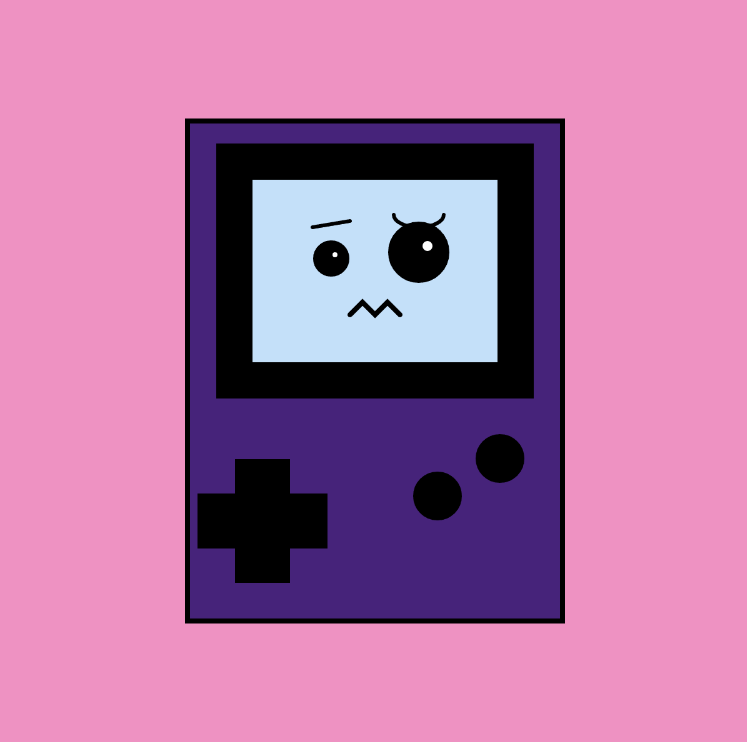

[Home 🏠](README.md) / [Portfolio 💼](https://sabrinarath263.wixsite.com/srathdesigns) / [Reflective Journal 📓](Journal.md) / [Assignments&Challenges](Assignments.md) / [Prototypes 💻](Prototypes.md)

# Prototypes

> Here you can access and view all my prototypes created during the term.

# Protoypes: instructions

# **1.  Click click Poyo!**

SABRINA RATH

[View this project online](https://sabiewasabi.github.io/CART253/prototypes/instructions/instructions-prototype-1/)

[View the code of this project](https://github.com/Sabiewasabi/CART253/blob/main/prototypes/instructions/instructions-prototype-1/js/click-click-poyo.js)

## Description

> *Click click Poyo!* is a interactable experience that allows the user to change the expression of Poyo by clicking it.

> The experience is controlled via the mouse, with left click. Each click will enable Poyo to dsply a different expression.

> The project is meant to give the user a sense of curious and surprise.By clicking on Poyo and having it showcase a new expression, users will then continue to click on Poyo to see hw many different faces it could make.

## Screenshot(s)

## Attribution

> - This project uses [p5.js](https://p5js.org).
> - The image is a capture of *Click click Poyo!* live on p5.js

## License
> This project is licensed under a Creative Commons Attribution ([CC BY 4.0](https://creativecommons.org/licenses/by/4.0/deed.en)) license with the exception of libraries and other components with their own licenses.

# **2. Confusion Gamestation**

SABRINA RATH

[View this project online](https://sabiewasabi.github.io/CART253/prototypes/instructions/instructions-prototype-2/)

[View the code to this project](https://github.com/Sabiewasabi/CART253/blob/main/prototypes/instructions/instructions-prototype-2/js/confusion-gamestation.js)

## Description

> *Confusion Gamastation* is a simulation experience that display an image of a gameboy with a silly face.

> The experience has no controls.

> The project is meant to be a weird gameboy looking back at it's owner confused, is it sentient?.

## Screenshot(s)

## Attribution

> - This project uses [p5.js](https://p5js.org).
> - The image is a capture of *Confusion Gamestation* live on p5.js

## License
> This project is licensed under a Creative Commons Attribution ([CC BY 4.0](https://creativecommons.org/licenses/by/4.0/deed.en)) license with the exception of libraries and other components with their own licenses.

# **3. Geminomonom**

SABRINA RATH

[View this project online](https://sabiewasabi.github.io/CART253/prototypes/instructions/instructions-prototype-3/)

[View the code to this project](https://github.com/Sabiewasabi/CART253/blob/main/prototypes/instructions/instructions-prototype-3/js/geminomonom.js)

## Description

> *Geminomonom* is a astract looping experience of a rotating gem with slightly illuminated edges that will then take on another shape every 5 seconds.

> The experience is controlled via dragging the gem with the cursor unveiling illuminating edges of the gem.

> The project is meant to for users to enjoy an alluring display of light and shadows morphing into different gem shapes which gives it a myserioous look.

> NOTE: As for now, the gem does not morph or change colour as I am currently working on how do to so.

## Screenshot(s)

## Attribution

> - This project uses [p5.js](https://p5js.org).
> - The image is a capture of *Emulation Gamestation* live on p5.js

## License
> This project is licensed under a Creative Commons Attribution ([CC BY 4.0](https://creativecommons.org/licenses/by/4.0/deed.en)) license with the exception of libraries and other components with their own licenses.

# Prototypes: variables
 To come very shortly,please anticipate the arrival!