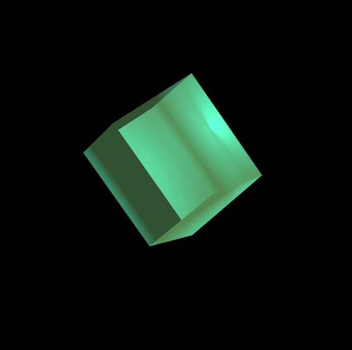

# Geminomonom 2.0

SABRINA RATH

[View this project online](https://sabiewasabi.github.io/CART253/prototypes/conditionals/conditionals-prototype-1/)

[View the code to this project](https://github.com/Sabiewasabi/CART253/blob/main/prototypes/conditionals/conditionals-prototype-1/js/geminomonom-2.0.js)

## Description

> *Geminomonom 2.0* is a reworking project on the first itteration *Geminomonom*. It is an astract looping experience of a rotating gem with slightly illuminated edges that will then take on another shape every 5 seconds.

> The experience is controlled via dragging the gem with the cursor unveiling illuminating edges of the gem.

> The project is meant to for users to enjoy an alluring display of light and shadows morphing into different gem shapes which gives it a myserioous look.

## Screenshot(s)

## Attribution

> - This project uses [p5.js](https://p5js.org).
> - The image is a capture of *Geminomonom 2.0* live on p5.js

## License
> This project is licensed under a Creative Commons Attribution ([CC BY 4.0](https://creativecommons.org/licenses/by/4.0/deed.en)) license with the exception of libraries and other components with their own licenses.