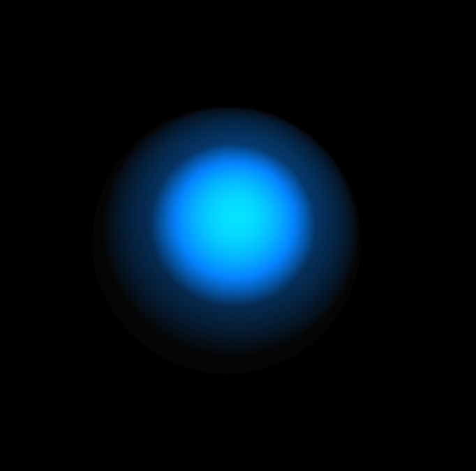

# Azure Marine Core

SABRINA RATH

[View this project online](https://sabiewasabi.github.io/CART253/prototypes/conditionals/conditionals-prototype-2/)

[View the code to this project](https://github.com/Sabiewasabi/CART253/blob/main/prototypes/conditionals/conditionals-prototype-2/js/azure-marine-core.js)

## Description

> This interactive 3D project uses an if/else blocks to manage two distinct environmental states. In its default calm state, the sphere drifts slowly with deep blue point-lighting and a glowing textual prompt.

> The experience is controlled via your cursor. When you click and holds the mouse, the code jitters erratically.

## Screenshot(s)

## Attribution

> - This project uses [p5.js](https://p5js.org).
> - The image is a capture of *Azure Marine Core* live on p5.js

## License
> This project is licensed under a Creative Commons Attribution ([CC BY 4.0](https://creativecommons.org/licenses/by/4.0/deed.en)) license with the exception of libraries and other components with their own licenses.