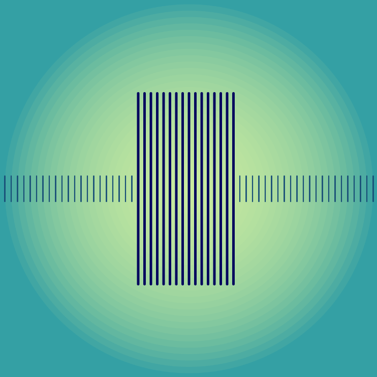

# Gradient Barcode

SABRINA RATH

[View this project online](https://sabiewasabi.github.io/CART253/prototypes/conditionals/contionals-prototype-3/)

[View the code to this project](https://github.com/Sabiewasabi/CART253/blob/main/prototypes/conditionals/conditionals-prototype-3/js/gradient-barcode.js)

## Description

> This project is an interactive barcode drawn on top of a gradient background.

> The experience is controlled by moving your mouse along the short verticalk lines to make them stretch out and get slightly thivker to create a wave.

> This project intends to capture the feeling of scanning a barcode.

## Screenshot(s)

## Attribution

> - This project uses [p5.js](https://p5js.org).
> - The image is a capture of *Gradient Barcode* live on p5.js

## License
> This project is licensed under a Creative Commons Attribution ([CC BY 4.0](https://creativecommons.org/licenses/by/4.0/deed.en)) license with the exception of libraries and other components with their own licenses.