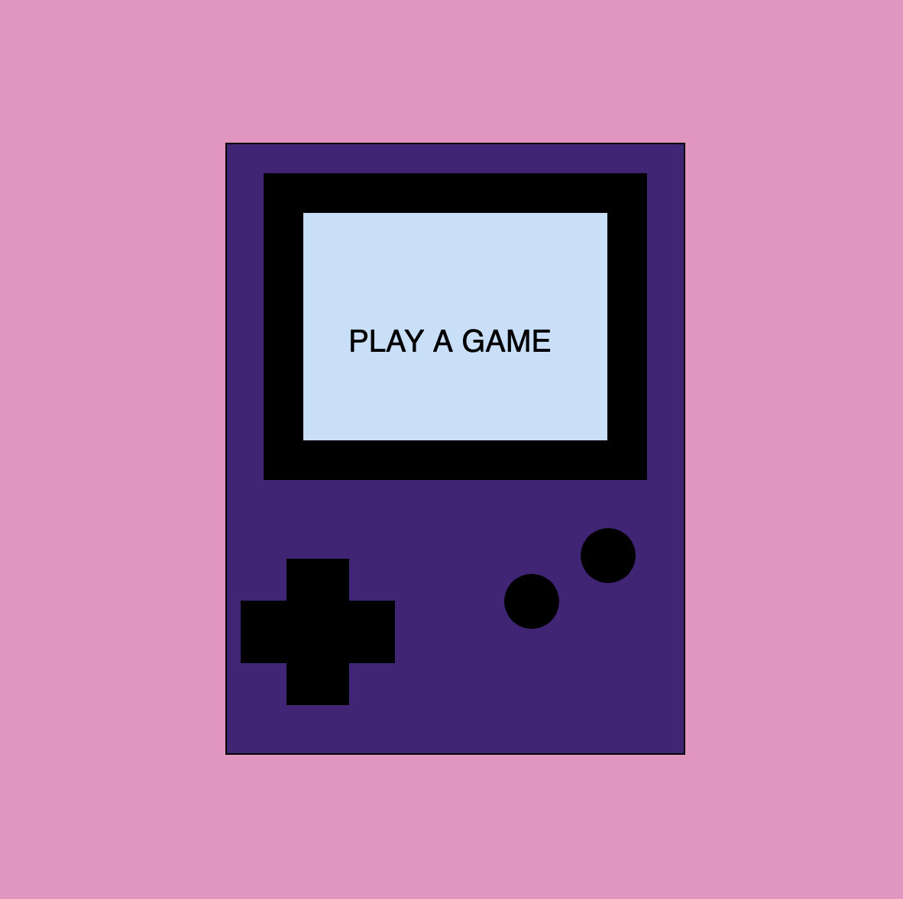

# Confusion Gamestation

SABRINA RATH

[View this project online](https://sabiewasabi.github.io/CART253/prototypes/instructions/instructions-prototype-2/)

## Description

> *Confusion Gamastation* is a simulation experience that allows the user to play a game through a small screen of a Gameboy.

> The experience is controlled via the WASD and arrow keys allowing the user to manipulate movement within the game.

> The project is meant to give the user the feeling of playing a emulation game through an actual Gameboy console creating a sense of nostalgia playing retro games.

## Screenshot(s)

## Attribution

> - This project uses [p5.js](https://p5js.org).
> - The image is a capture of *Confusion Gamestation* live on p5.js

## License
> This project is licensed under a Creative Commons Attribution ([CC BY 4.0](https://creativecommons.org/licenses/by/4.0/deed.en)) license with the exception of libraries and other components with their own licenses.