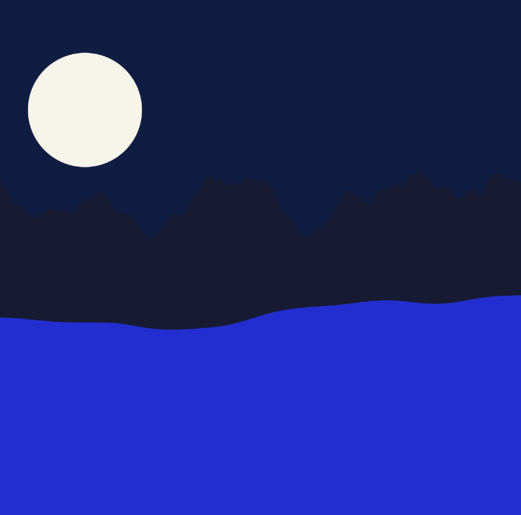

# Wavelengths

SABRINA RATH

[View this project online](https://sabiewasabi.github.io/CART253/prototypes/variables/variables-prototype-2/)

[View the code to this project](https://github.com/Sabiewasabi/CART253/blob/main/prototypes/variables/variables-prototype-2/js/wavelengths.js)

## Description

> A layered landscape featuring mountains and smooth waves at the foreground using noise and a bright moon looking over the ocean.

> This project was created with intentions of giving the viewers a sense of calm,stillness and serenity while gazing at one of nature's delight - cascading waves with a view.

## Screenshhot(s)

## Attribution

> - This project uses [p5.js](https://p5js.org).
> - The clown image is a capture of *Wavelengths* live on p5.js.

## License

> This project is licensed under a Creative Commons Attribution ([CC BY 4.0](https://creativecommons.org/licenses/by/4.0/deed.en)) license with the exception of libraries and other components with their own licenses.